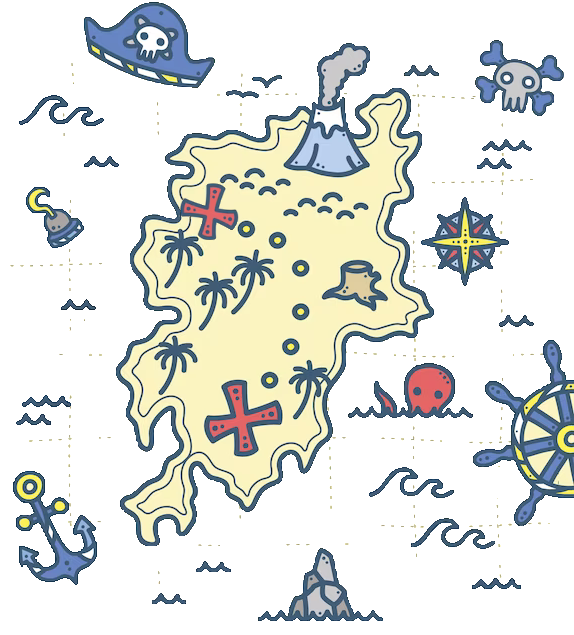

# PathFindingAI

<!--  -->

  

PathFindingAI is an AI that follows a target in a game.

For a description of the work consult the doc folder.

***
## Goals

We developed this project with some goals in mind:
- Performance: we want that this AI is effectively ready to be implemented in a game that runs at least at 60 fps.
- Plausibility: we want that the action of the AI is really understandable. For example, we want to 

***
## Features

Showcase of the ai in action: https://www.youtube.com/watch?v=OsOChnBTgcI

The following AI has these features:
- Line of sight: implemented Line Of Sight(in an adapted version for tilegame with grid-based movement) to not track player
that are hidden from a wall.   
- An optimized implementation of the A* algorithm to find an optimal path efficiently.
- Registering and using the last pos: when the "eye contact" is interrupted, no worries, the AI register the last location of the target and move to that location to explore the area.
- Idle: a simple routine to explore the area when there isn't many information about the target position.

***
## Try the demo

To compile the repository, you must use premake5.

I developed this demo in vs2017.

***
## Files
The AI is developed in the following files:

***

